#  Lecture RAG System
**Local Retrieval-Augmented QA for Lecture Slides**

A local RAG system for querying lecture slides and retrieving verifiable answers with explicit source references.  
Built for study workflows: Users upload lecture PDFs, which are processed into semantically searchable chunks for grounded question answering using local LLM inference with `vLLM`.

> Focus: Fast, local, and verifiable knowledge retrieval for exam preparation and study workflows.

---

##  Motivation

When preparing for exams, students often need to:

- Quickly find relevant information across many slides
- Understand concepts in context
- Verify answers against original material

This project addresses that by combining:
- **semantic search over lecture slides**
- **LLM-based summarization**
- **explicit source grounding**

The system generates answers strictly from retrieved lecture chunks and appends explicit source references for verification.

---

## Key Features

- **PDF Slide Ingestion**
  - Extracts structured text (source, page, content) from lecture PDFs

- **Semantic Retrieval (RAG)**
  - Retrieves relevant slide chunks based on query embeddings

- **Source-Grounded Answers**
  - Answers are derived strictly from retrieved lecture content

- **Streaming Responses (vLLM)**
  - Near-instant responses after initial warm-up

- **Local**
  - Runs fully locally (no external APIs required)

---
## Engineering Highlights

- End-to-end RAG pipeline (ingestion → retrieval → generation)
- Local LLM serving with vLLM
- Semantic retrieval + reranking pipeline
- Streaming API with FastAPI
- Containerized deployment with Docker

---

## Project Structure

```text
lecture-rag/backend/
├── api/                    # FastAPI endpoints and application startup
├── database/               # SQLite models and ingestion logic
├── chunking/               # Slide-aware chunking strategies
├── pdf_preprocessing/      # PDF extraction and cleaning
├── response_generation/    # Retrieval, reranking and RAG pipeline
├── tests/                  # Python files for testing Ingestion Variants and Q&A

├── main.py                 # FastAPI application entry point
├── docker-compose.yml
├── Dockerfile
└── README.md
```
--- 

## Why vLLM: Performance

Comparison against a local baseline using standard Hugging Face Transformers inference:

| Metric                   | Transformers | vLLM                   |
|--------------------------|--------------|------------------------|
| Startup + First response | \>30s        | ~120s (initial warmup) |
| Subsequent queries       | \>30s        | ~1s                    |


- **Drawback:** vLLM introduces a higher startup cost and time due to model compilation
- After warmup, response latency is significantly reduced
- Streaming enables immediate feedback to the user

This trade-off makes vLLM well-suited for interactive applications.


---


## Architecture Overview

The system is split into two independent pipelines sharing a central SQLite store.
The upload pipeline ingests PDFs, cleans and chunks lecture slides, and stores
embeddings. The query pipeline embeds the user's question, retrieves the top 30
candidates, reranks to 5, and streams a grounded answer via vLLM.


---


## Model & Design Decisions

### LLM Selection

The system uses `Qwen/Qwen3.5-2B`, chosen for:

- Strong quality-to-size ratio
- Compatibility with limited GPU resources (10GB VRAM)

Smaller models (e.g. 0.8B) would further reduce resource requirements, 
but showed noticeably degraded answer quality in initial tests.

---

### Embedding Model

- `intfloat/multilingual-e5-small`
- Chosen for:
  - Multilingual capability
  - Low computational overhead
  - Good performance for semantic retrieval

---

### Reranking

- `cross-encoder/ms-marco-MiniLM-L-6-v2`
- Improves retrieval precision with minimal latency increase

---

### Chunking & Preprocessing

#### Text Cleaning 

Before chunking, each PDF page is cleaned to reduce parsing artifacts:

- Normalize whitespace and line breaks
- Remove isolated numeric artifacts from PDF extraction
- Heuristic title propagation for slide continuations
  (e.g. “continued”, “step”, “phase”)

Two chunking strategies are applied depending on the detected document type,
selected automatically based on average characters per page.

#### Slide documents 
Use a fixed sliding window (`SlidesChunker`): groups of 3
pages are merged into one chunk with a 1-page overlap, keeping related points
on adjacent slides together.

#### Text-heavy documents
Fall back to `RollingSemanticChunker`, which attempts
to split on topic shifts by comparing page embeddings against a rolling window
of previous pages. In practice, lecture material tends to have high semantic
similarity throughout, so boundary detection is imprecise — this path is a
best-effort fallback rather than a robust solution.

## Getting Started

### Requirements

- Docker
- NVIDIA GPU, `cuda>=12.9.0` 

---

### Run the backend

#### First time / after changes
Rebuilds the image:
```bash
docker compose up --build
```

#### Subsequent starts
If the image is already built and code hasn't changed:
```bash
docker compose up
```

#### Clean restart (e.g. after schema changes)
Stop and remove containers and network as well as volumes/the database (-v)
```bash
docker compose down -v
docker compose up --build
```

## Usage Example

### Quick start via Swagger UI
- Useful for uploading lecture PDFs and testing endpoints manually.

Open `http://localhost:8000/docs` in browser, select corresponding function. Downside: responses are not streamed.

### Request
```bash
curl -N -X POST http://localhost:8000/ask_stream \
  -H "Content-Type: application/json" \
  -d "{\"question\":\"What are SOLID principles?\",\"lecture_name\":\"SWT2\"}"
```

## Limitations

- No dedicated frontend yet
- PDF parsing quality depends on slide structure
- Exact similarity search over SQLite embeddings does not scale to large corpora 
  - would require a vector database backend for larger deployments.
- Small, not as powerful models for reranking and response generation 
  - Response generation quality may degrade for non-English queries.
- No formal retrieval evaluation benchmark (yet)